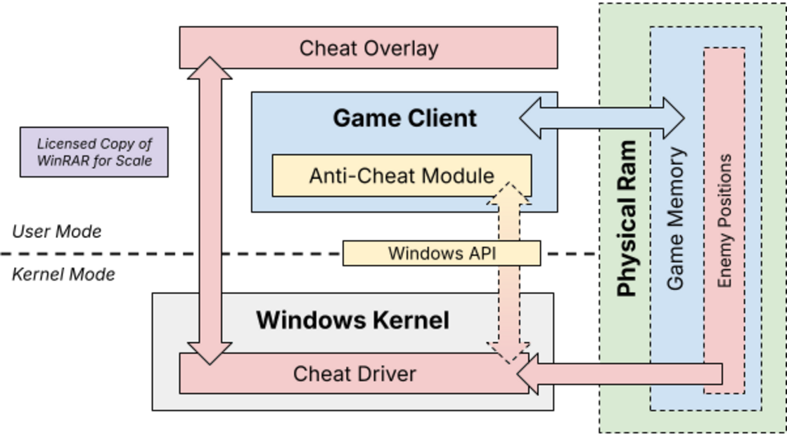

## Introduction  

The videogame industry consistently has to confront the issue of cheating. This challenge has intensified with technological advancements in gaming, prompting a response from game developers in the form of anti-cheat systems.

During the last years, there has been an escalation on how cheats are working and upgrading: 

- Cheats that run in Usermode  

- Cheats that run at kernel level 

- Kernel cheats with BYOVD (with a custom vulerable driver) 

- Hypervisor-based cheats 

- DMA Cheats (Direct Memory access)  

- Firmware-based attacks (SSD, RAM, GPU) 

## Architecture of a Kernel Anti-Cheat 

Early anti-cheat ran in userspace: a process monitored the game process for memory modifications, injected DLLs, or known cheat patterns.

This was effective against simplistic cheats but trivially bypassed: any process with sufficient privileges can inject code, manipulate memory, or hide itself from user-space monitoring.

The fundamental problem with usermode-only anti-cheat is the trust model. Any protection implemented entirely in usermode can be bypassed by anything running at a higher privilege level.

The main difference between the different levels of privilege is the accessibility of memory and instructions. User mode (ring 3) applications are isolated from kernel mode (ring 0) applications, because kernel-mode determines how user-mode behaves, and usermode-mode applications therefore cannot access kernel memory. 
 

## Why kernel mode? 

Kernel-mode cheats could directly manipulate game memory without going through any API that a usermode anti-cheat could intercept. 
 

Kernel anti-cheat deploys as a Windows kernel driver (`.sys` file). the driver is loaded at boot (for persistent systems like `Vanguard`) or at game launch (for on-demand systems). 

## Boot-time vs Runtime Driver Loading 

The distinction between boot-time and runtime driver loading is more significant than it might appear.

BattlEye and EAC load their kernel drivers when the game is launched. They are registered as demand-start drivers and loaded via a driver loader from the service when the game starts. They are unloaded when the game exits.

Vanguard loads `vgk.sys` at system boot. The driver is configured as a boot-start driver (`SERVICE_BOOT_START` in the registry), meaning the Windows kernel loads it before most of the system has initialized.

This gives Vanguard a critical advantage: it can observe every driver that loads after it. Any driver that loads after `vgk.sys` can be inspected before its code runs in a meaningful way.

A cheat driver that loads at the normal driver initialization phase is loading into a system that Vanguard already has eyes on. 

The practical implication of boot-time loading is also why Vanguard requires a system reboot to enable: the driver must be in place before the rest of the system initializes, which means it cannot be loaded after the fact without a restart.

## The three types of detections (all 3 are needed)

- `Kernel driver`: Runs at ring 0. Registers callbacks, intercepts system calls, scans memory, enforces protections. This is the component that actually has the power to do anything meaningful.

- `Usermode service`: Runs as a Windows service, typically with `SYSTEM` privileges. Communicates with the kernel driver via IOCTLs. Handles network communication with backend servers, manages ban enforcement, collects and transmits telemetry.  

- `Game-injected DLL`: Injected into (or loaded by) the game process. Performs usermode-side checks, communicates with the service, and serves as the endpoint for protections applied to the game process specifically.

## Example of how it works (Vanguard)

Once the video game and its associated anti-cheat software are installed, a system process is created (e.g., `vgk.sys` for Riot Vanguard). This process runs in Kernel Ring 0. the system's deepest privilege level—ensuring it loads before any cheats can be launched. 

Next, the executable program (such as `vgc.exe` for Vanguard and Valorant) verifies that the anti-cheat is running, establishing a bridge between the kernel-level process and the game client.

The anti-cheat activates upon system startup; when the game is launched, it checks whether the anti-cheat is running and starts it if it isn't already active.   

Once the game client is running, the kernel-level anti-cheat monitors for and blocks malicious data loads, unsigned code, exploits, and code injections.   

Writing to the game's memory is prevented at both Ring 3 and Ring 0 levels.

The anti-cheat performs specific checks to detect analysis tools; if suspicious behavior is detected, it issues a ban based on the machine's `HWID` (Hardware ID). 

The kernel driver uses a whitelist of allowed DLLs. Any other DLL which tries to load will be killed.

#### Anticheat-detections

- Memory Protection and Scanning  

- Anti-Injection Detection  

- Hook Detection  

- Driver-Level Protections  

- Anti-Debug Protections  

- DMA Cheats and Detection

- Behavioral Detection and Telemetry (mouse, ML, IA)  

- Anti-VM and Environment Checks  

- Hardware Fingerprinting and Ban Enforcement  
 

## References

- [s4dbrd - How-kernel-anti-cheats-work](https://s4dbrd.github.io/posts/how-kernel-anti-cheats-work/) 

- [Why anti-cheat software utilize kernel drivers](https://secret.club/2020/04/17/kernel-anticheats.html) 

- [Example EasyAntiCheat Exploit](https://aftermathlabs.net/blog/10/08/2021/) 

- [Hacking Forum - Kernel anticheat analysis](https://hackingfordummies.com/articles/kernel-anticheat-analysis/) 

- [Wikipedia - Protection rings](https://en.wikipedia.org/wiki/Protection_ring) 

- [Wiki - What is a kernel driver](https://wiki.lckfb.com/en/linux-docs-tspi3-rk3576/linux-driver-Basics/kernel-driver-intro/kernel-module-drivers.html) 

- [Zach Vohries - CrowdStrike Analysis](https://x.com/Perpetualmaniac/status/1814376668095754753)

- [VGK DriverEntry Analysis](https://gist.github.com/gmh5225/2b430b6025c8888196dd95c8557bfc6f)